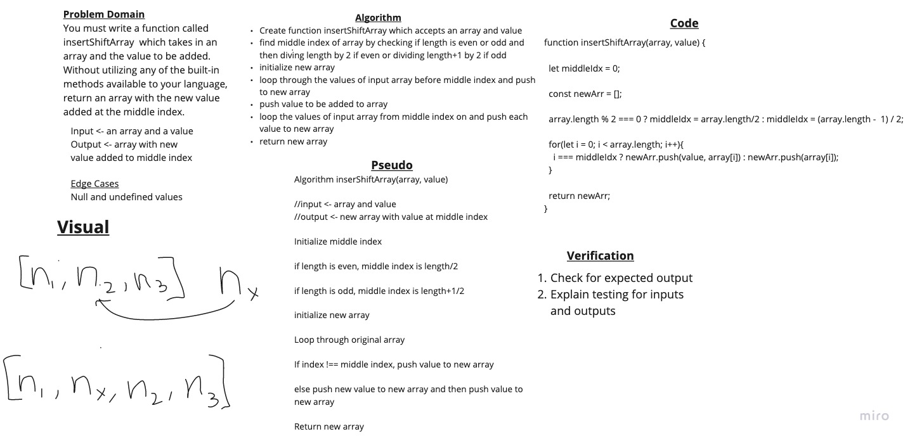

# Data Structures and Algorithms

## 401 Data Structures, Code Challenges

### Shift Array

View Solution: [code](./javascript/arrayShift/array-shift.js)

Write a function called insertShiftArray which takes in an array and the value to be added. Without utilizing any of the built-in methods available to your language, return an array with the new value added at the middle index.

