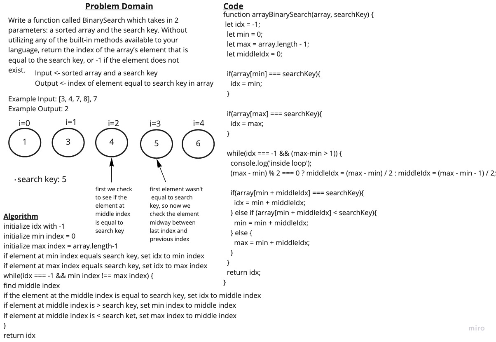

# Challenge Summary - Array Binary Search

[<--- Back to Table of Contents](../../../README.md)

## Challenge Description

Write a function called BinarySearch which takes in 2 parameters: a sorted array and the search key. Without utilizing any of the built-in methods available to your language, return the index of the array’s element that is equal to the search key, or -1 if the element does not exist.

## Approach & Efficiency

I started out by whiteboarding the problem domain and then planned each step of my algorithm. Then I wrote some tests and then wrote code that passed my tests and matched my algorithm.

## Solution

View Solution: [code](./array-binary-search.js)

Write a function called insertShiftArray which takes in an array and the value to be added. Without utilizing any of the built-in methods available to your language, return an array with the new value added at the middle index.

