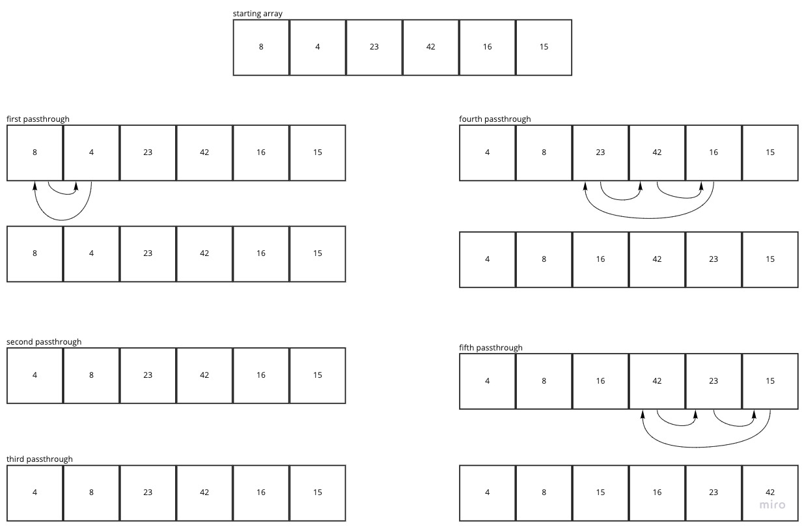

# Insertion Sort - JS Implementation

*By Peter Staker*

## Introduction

Insertion Sort is a sorting algorithm that traverses the array. For each passthrough, the current value at index i is repeatedly compared to the value at the previous index and swapped until the previous value is smaller than the current value. The array is sorted in place.

## Pseudocode

```pseudocode
  InsertionSort(int[] arr)
  
    FOR i = 1 to arr.length
    
      int j <-- i - 1
      int temp <-- arr[i]
      
      WHILE j >= 0 AND temp < arr[j]
        arr[j + 1] <-- arr[j]
        j <-- j - 1
        
      arr[j + 1] <-- temp
```

The Pseudocode is a function InsertionSort that takes in an array of integers. It loops over the array starting at the second value in the array. Within the for loop, a variable, j is assigned the value of the previous value in the array and a variable, temp is assigned the value at the current index. Then the value is repeatedly compared to the previous value and while temp is less than the value at index j and j is not negative, j is decremented.

## Visual Representation



### First passthrough:

The first pass through compares 4 to 8 and since it is less than 8, the values are swapped.

### Second passthrough:

Since 23 is larger than 8, the array remains the same.

### Third passthrough:

Since 42 is larger than 23, the array remains the same.

### Fourth passthrough:

Since 16 is less than 42, the two values are swapped and then 16 is compared to 23 and the values are then swapped.

### Fifth passthrough:

Since 15 is less than 42, the two values are swapped and then 16 is compared to 23 and the values are then swapped.

The resulting array is [4, 8, 15, 16, 23, 42]

## Javascript Implementation

```javascript
function insertionSort(arr){
  for(let i = 1; i < arr.length; i++){
    let j = i - 1;
    let temp = arr[i];

    while((j >= 0) && (temp < arr[j])){
      arr[j + 1] = arr[j];
      j--;
    }
    arr[j + 1] = temp;
  }
  return arr;
}
```
