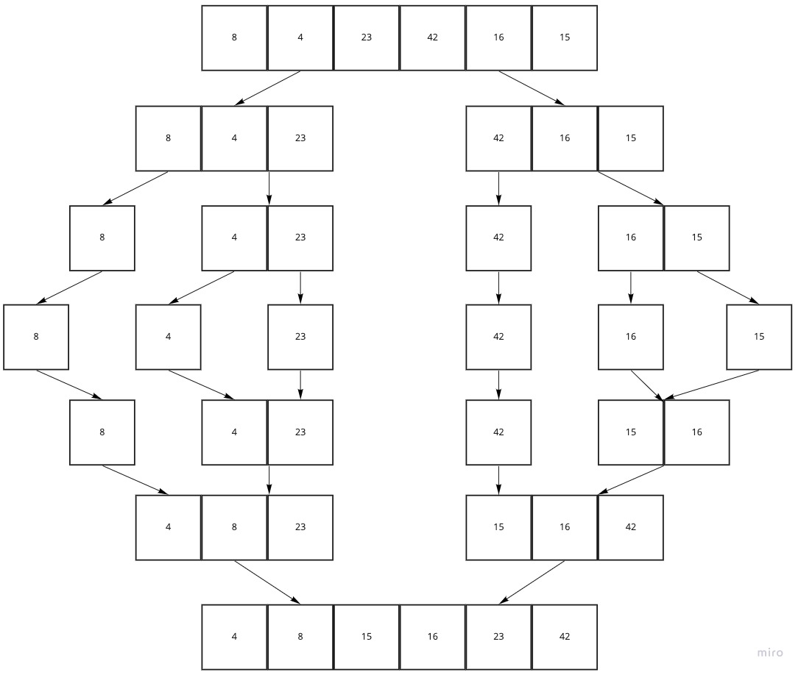

# Merge Sort - JS Implementation

*By Peter Staker*

## Introduction

Merge Sort is a sorting algorithm that splits up the values of an array and then merges them in a sorted order. It is a very efficient sorting algorithm - O(log n).

## Pseudocode

```pseudocode
ALGORITHM Mergesort(arr)
    DECLARE n <-- arr.length
           
    if n > 1
      DECLARE mid <-- n/2
      DECLARE left <-- arr[0...mid]
      DECLARE right <-- arr[mid...n]
      // sort the left side
      Mergesort(left)
      // sort the right side
      Mergesort(right)
      // merge the sorted left and right sides together
      Merge(left, right, arr)

ALGORITHM Merge(left, right, arr)
    DECLARE i <-- 0
    DECLARE j <-- 0
    DECLARE k <-- 0

    while i < left.length && j < right.length
        if left[i] <= right[j]
            arr[k] <-- left[i]
            i <-- i + 1
        else
            arr[k] <-- right[j]
            j <-- j + 1
            
        k <-- k + 1

    if i = left.length
       set remaining entries in arr to remaining values in right
    else
       set remaining entries in arr to remaining values in left

```

The Pseudocode uses two functions, Mergesort and Merge.

Merge iterated through two sorted arrays and compares the value at each index. The smaller value is then added to the sorted array and the value that wasn't added is then compared to the next value in the other array. This is repeated until all of the values from both arrays have been added to the new array and then the new sorted array is returned.

Mergesort is a recursive function that takes an array as an argument. If the length of the array is greater than 1, the array is split in half repeatedly until all values have their own arrays and merged back together in a sorted order using the Merge function.

## Visual Representation



This is a visual illustration to help conceptualize this.

## Javascript Implementation

```javascript
function _mergeSort(arr){
  const n = arr.length;

  if(n > 1){
    const mid = Math.floor(n/2);
    const left = arr.slice(0, mid);
    const right = arr.slice(mid);
    return merge(_mergeSort(left), _mergeSort(right));
  } else {
    return arr;
  }
}

function merge(left, right){
  let i = 0;
  let j = 0;
  let k = [];

  while(i < left.length && j < right.length){
    if(left[i] <= right[j]){
      k.push(left[i]);
      i++;
    } else {
      k.push(right[j]);
      j++;
    }
  }

  return k.concat(left.slice(i)).concat(right.slice(j));
}
```

[View Implementation](./mergeSort.js)

[View Tests](./merge-sort.test.js)
