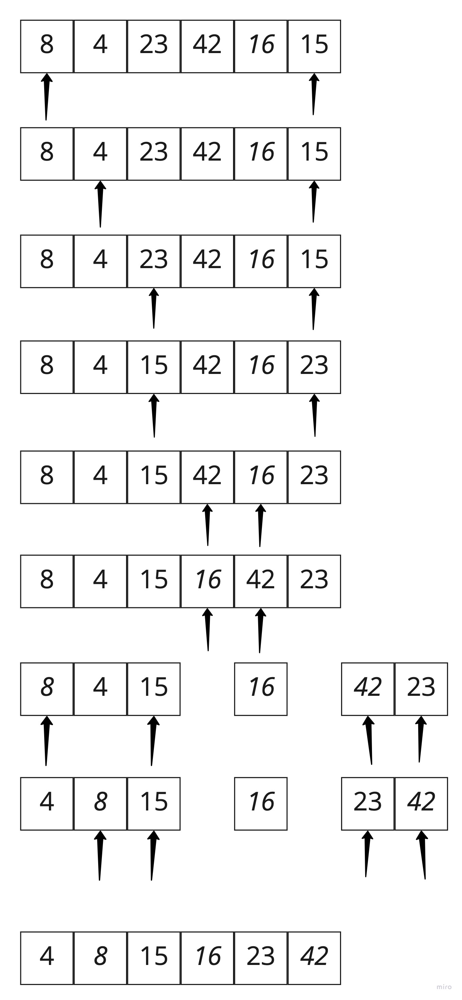

# Quick Sort - JS Implementation

*By Peter Staker*

## Introduction

Quick sort is a sorting algorithm that splits up an array into equal parts and sets a pointer to both ends of the array and a pivot in the middle of the array. If the left value is greater than the pivot and the right is less than the pivot they are swapped. This is done recursively until the pointers meet in the middle. It is a very efficient sorting algorithm - O(log n).

## Pseudocode

```pseudocode

ALGORITHM QuickSort(arr, left, right)
    if left < right
        // Partition the array by setting the position of the pivot value 
        DEFINE position <-- Partition(arr, left, right)
        // Sort the left
        QuickSort(arr, left, position - 1)
        // Sort the right
        QuickSort(arr, position + 1, right)

ALGORITHM Partition(arr, left, right)
    // set a pivot value as a point of reference
    DEFINE pivot <-- arr[right]
    // create a variable to track the largest idx of numbers lower than the defined pivot
    DEFINE low <-- left - 1
    for i <- left to right do
        if arr[i] <= pivot
            low++
            Swap(arr, i, low)

     // place the value of the pivot location in the middle.
     // all numbers smaller than the pivot are on the left, larger on the right. 
     Swap(arr, right, low + 1)
    // return the pivot idx point
     return low + 1

ALGORITHM Swap(arr, i, low)
    DEFINE temp;
    temp <-- arr[i]
    arr[i] <-- arr[low]
    arr[low] <-- temp

```

The Pseudocode uses three functions: Quicksort, Partition and Swap and splits up an array into equal parts and sets a pointer to both ends of the array and a pivot in the middle of the array. If the left value is greater than the pivot and the right is less than the pivot they are swapped. This is done recursively until the pointers meet in the middle.

## Visual Representation



This is a visual illustration to help conceptualize quick sort.

## Javascript Implementation

```javascript
function _quickSort(arr, left = 0, right = arr.length-1){
  let idx;

  if(arr.length > 1){
    idx = partition(arr, left, right);

    if(left < idx-1){
      _quickSort(arr, left, idx-1);
    }

    if(idx < right){
      _quickSort(arr, idx, right);
    }

  }
  return arr;
}

function partition(arr, left, right) {
  let pivot = arr[Math.floor((right + left)/2)];
  let i = left;
  let j = right;
  while(i <= j){

    while(arr[i] < pivot){
      i++;
    }

    while(arr[j] > pivot){
      j--;
    }

    if(i <= j){
      swap(arr, i, j);
      i++;
      j--;
    }
  }
  return i;
}

function swap(arr, i, j){
  let temp = arr[i];
  arr[i] = arr[j];
  arr[j] = temp;
}
```

[View Implementation](./quickSort.js)

[View Tests](./quick-sort.test.js)