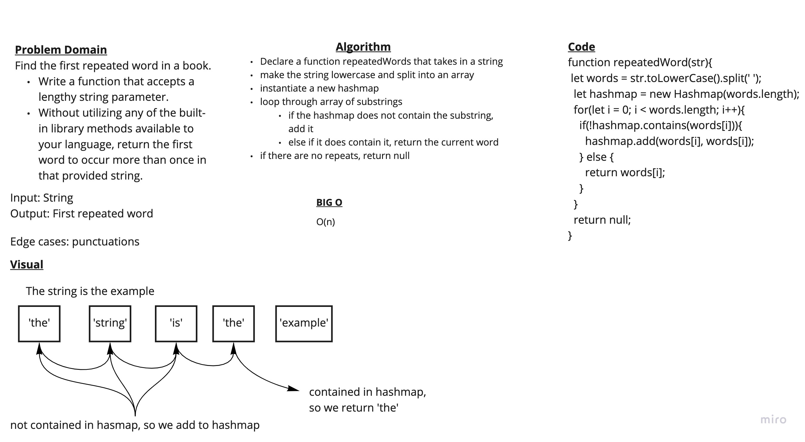

# Linked Lists

## Challenge Summary - Repeated Word

[<--- Back to Table of Contents](../../../README.md)

### Challenge Description - Repeated Word

Find the first repeated word in a book.

* Write a function that accepts a lengthy string parameter.

* Without utilizing any of the built-in library methods available to your language, return the first word to occur more than once in that provided string.

### Approach & Efficiency - Repeated Word

I used a hashmap for my solution. I first split the string into an array of substrings and then loop through my array. If the current substring isn't contained in my hashmap, I add it. If it is contained in the hashmap, I return the current word. My solution is O(n).

### Solution - Repeated Word

View Solution: [code](./repeated-word.js)

