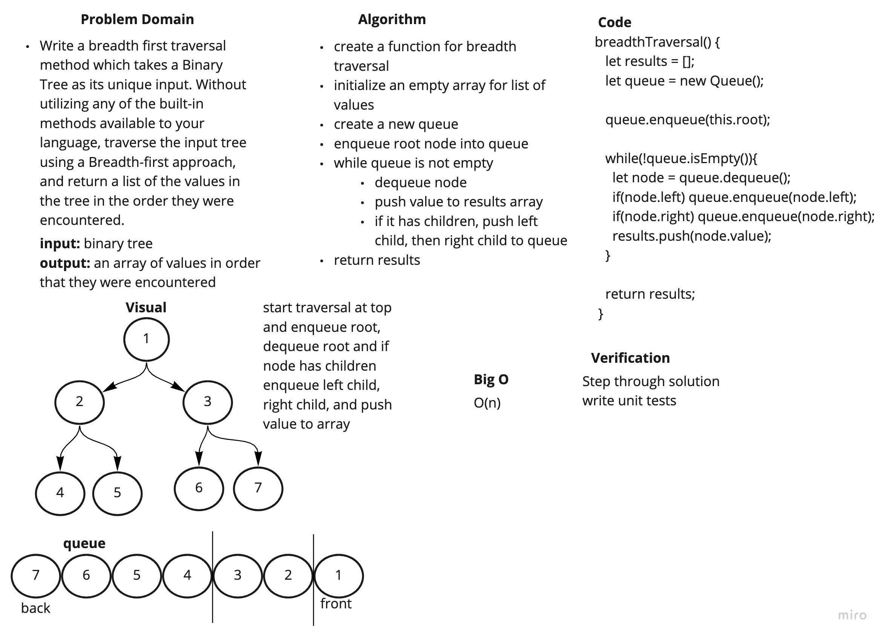

# Challenge Summary

Write a breadth first traversal method for a binary tree.

## Challenge Description

Write a breadth first traversal method which takes a Binary Tree as its unique input. Without utilizing any of the built-in methods available to your language, traverse the input tree using a Breadth-first approach, and return a list of the values in the tree in the order they were encountered.

## Approach & Efficiency

I initalized an empty array and then used a queue for breadth first traversal. My solution is O(n).

## Solution

[code](../binary-tree.js)

