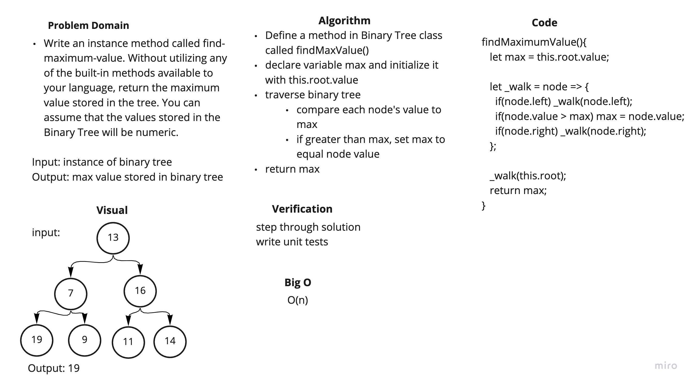

# Challenge Summary

Write an instance method for Binary Tree class that finds the maximum value.

## Challenge Description

Write an instance method called find-maximum-value. Without utilizing any of the built-in methods available to your language, return the maximum value stored in the tree. You can assume that the values stored in the Binary Tree will be numeric.

## Approach & Efficiency

I declare a max variable and set it to the value of the root node and then used in order traversal and compared each value to the max variable. My solution is
O(n).

## Solution

[code](../binary-tree.js)

