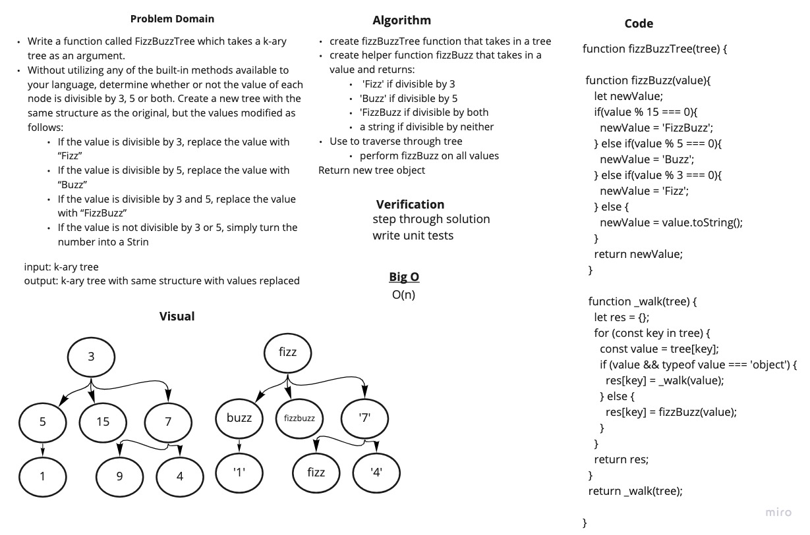

# Challenge Summary

Conduct “FizzBuzz” on a k-ary tree while traversing through it to create a new tree.

## Challenge Description

Write a function called FizzBuzzTree which takes a k-ary tree as an argument.
Without utilizing any of the built-in methods available to your language, determine whether or not the value of each node is divisible by 3, 5 or both. Create a new tree with the same structure as the original, but the values modified as follows:

* If the value is divisible by 3, replace the value with “Fizz”

* If the value is divisible by 5, replace the value with “Buzz”

* If the value is divisible by 3 and 5, replace the value with “FizzBuzz”

* If the value is not divisible by 3 or 5, simply turn the number into a String.

Return a new tree.

## Approach & Efficiency

I created a fizzBuzzTree function that takes in a tree a helper function fizzBuzz that takes in a value and returns:

* 'Fizz' if divisible by 3

* 'Buzz' if divisible by 5

* 'FizzBuzz if divisible by both

* a string if divisible by neither

Then I traversed through the tree and performed fizzBuzz on all values and returned a new tree object. My solution is O(n).

## Solution

[code](./fizz-buzz-tree.js)

