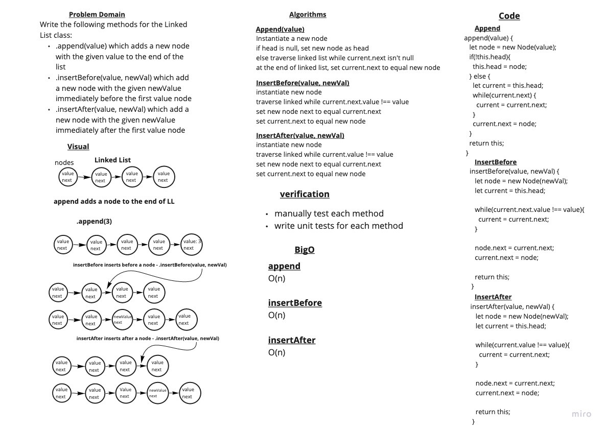

# Linked Lists

## Challenge Summary - Linked List

[<--- Back to Table of Contents](../../README.md)

### Challenge Description - LL Implementation

Implement a LinkedList with an insert method, toString method and includes method.

### Approach & Efficiency - LL Implementation

I used the implementation we went over in class and added an insert method insert method, toString method and includes method.

### Solution - LL Implementation

View Solution: [code](./linked-list.js)

## Challenge Summary - Linked List Insertions

### Challenge Description - LL Insertions

Write the following methods for the Linked List class:

.append(value) which adds a new node with the given value to the end of the list
.insertBefore(value, newVal) which add a new node with the given newValue immediately before the first value node
.insertAfter(value, newVal) which add a new node with the given newValue immediately after the first value node

### Approach & Efficiency - LL Insertions

I started out by whiteboarding the problem domain and then planned each step of my algorithms. Then I wrote some tests and then wrote code that passed my tests and matched my algorithms.

### Solution - LL Insertions

View Solution: [code](./linked-list.js)

## Challenge Summary - Linked List Kth from the End

### Challenge Description - Linked List Kth from the End

Write a method for the Linked List class which takes a number, k, as a parameter. Return the node’s value that is k from the end of the linked list. You have access to the Node class and all the properties on the Linked List class as well as the methods created in previous challenges.

### Approach & Efficiency - Linked List Kth from the End

I started out by whiteboarding the problem domain and then planned each step of my algorithms. Then I wrote unit tests: 

1. Where k is greater than the length of the linked list

1. Where k and the length of the list are the same

1. Where k is not a positive integer

1. Where the linked list is of a size 1

1. “Happy Path” where k is not at the end, but somewhere in the middle of the linked list

### Solution - Linked List Kth from the End

View Solution: [code](./linked-list.js)

