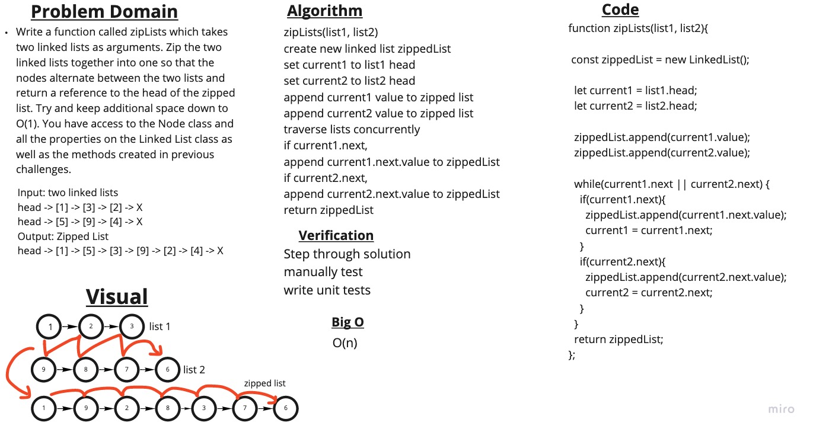

# Challenge Summary - Linked List Zip

[<--- Back to Table of Contents](../../README.md)

## Challenge Description - Linked List Zip

Write a function called zipLists which takes two linked lists as arguments. Zip the two linked lists together into one so that the nodes alternate between the two lists and return a reference to the head of the zipped list. Try and keep additional space down to O(1). You have access to the Node class and all the properties on the Linked List class as well as the methods created in previous challenges

## Approach & Efficiency - Linked List Zip

I started out by whiteboarding the problem domain and reviewing the methods I had available from the linked list class that I previously implemented. I figured out my algotithm, then I wrote my code, manually tested it and wrote unit tests.

## Solution - Linked List Zip

View Solution: [code](./ll-zip.js)

